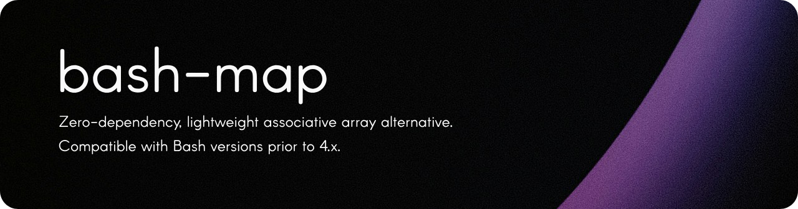

<div align="center">
  <picture>
    <source media="(prefers-color-scheme: dark)" srcset=".github/readme.png" />
    
  </picture>
  <hr />
  <a href="https://github.com/dir/bash-map/actions"></a>
  <a href="https://github.com/dir/bash-map/blob/main/LICENSE.md"></a>
  <a href="https://www.gnu.org/software/bash"></a>
  <a href="https://www.shellcheck.net"></a>
  <br />
  <br />
  <figure>
    
    <figcaption>
      <p align="center">
        All functions are fully documented with tooltips and examples right in your IDE using <a href="https://github.com/bash-lsp/bash-language-server">bash-language-server</a>.
      </p>
    </figcaption>
  </figure>
</div>

## Intro

bash-map allows you to perform robust key-value operations in pure Bash without built-in associative arrays (which are only available in Bash 4.x and later).

### Highlights

- 🐚&nbsp; Pure Bash implementation - no external dependencies (not even `sed`, _which on macOS is about as reliable as a politician's promise_)
- 🔁&nbsp; Backwards compatible with Bash versions **prior to 4.x**
- 🧰&nbsp; Comprehensive API - `make`, `get`, `set`, `delete`, `print`, `clear`, `size`, `keys`, `values`, and more
- 📦&nbsp; Portable and easily integrable into existing shell scripts
- 🚀&nbsp; Lightweight with minimal overhead
- 🔧&nbsp; Modern scripting practices - passes [ShellCheck](https://www.shellcheck.net), well-documented ([shdoc](https://github.com/reconquest/shdoc)), and testable ([shUnit2](https://github.com/kward/shunit2))
- 🔒&nbsp; Safe string handling with special character escaping

## Quickstart

### Installation

You have two main options for using bash-map:

1. Clone the repository:

   ```bash
   git clone https://github.com/dir/bash-map.git
   cd bash-map
   ```

2. Copy the script directly:

   You can copy the contents of `src/bash-map.sh` into your project or download it:

   ```bash
   curl -O https://raw.githubusercontent.com/dir/bash-map/main/src/bash-map.sh
   ```

### Usage

1. Source the script in your Bash environment:

   If you cloned the repo or have the script in your project directory:

   ```bash
   #!/bin/bash

   source {path_to_script}/bash-map.sh
   # or . {path-to-script}/bash-map.sh
   ```

   If you've installed it in your PATH:

   ```bash
   #!/bin/bash

   source bash-map
   # or . bash-map
   ```

2. Basic operations:

```bash
#!/bin/bash

. bash-map

# Create a new map
map::make user "
  [name]=John Doe
  [age]=30
  [spaces are allowed]=true
  [whitespace]  =  is allowed
"

# Set key-value pairs
map::set user "city" "New York"

# Get values
name=$(map::get user "name")
echo "Name: $name"

# Check if a key exists
if map::has user "age"; then
  echo "Age is set"
fi

# Update key-value pairs
map::set user "age" 31

# Delete a key
map::delete user "spaces are allowed"

# Get all keys (default delimiter is ,)
keys=$(map::keys user -d " ")
echo "Keys: $keys"

# Get all values
values=$(map::values user)
echo "Values: $values"

# Get map size
size=$(map::size my_map)
echo "Map size: $size"

# Print the entire map
map::print user

# Clear the map
map::clear user
```

These examples demonstrate the core functionality of bash-map. For more detailed information on each function and additional features, refer to the full documentation or use the built-in help tooltips in your IDE if you're using [bash-language-server](https://github.com/bash-lsp/bash-language-server).
